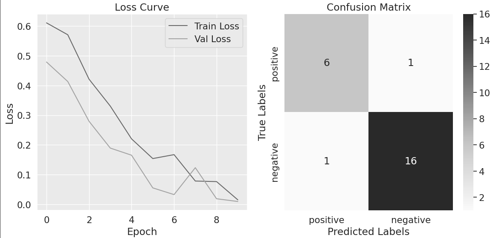

# TWITTER SENTIMENT

### **OVERVIEW**

**Sentiment Analyzer for Game Communities: The Commercial Value of Understanding Public Reaction**

In today's gaming landscape, games are no longer just finished products released into the market. They have become ever-evolving services, constantly updated with bug fixes, patches, and announcements of future features. In this context, it is crucial for game companies to understand the community's reaction to these game modifications.

A sentiment analyzer for tweets generated by game communities plays a vital role in this scenario. It allows companies to monitor and analyze public opinion regarding news about tournaments, bug fixes, updates, and future patches, among other aspects. The ability to observe and interpret community responses in real-time is an invaluable asset for game companies.

The sentiment analyzer program developed focuses specifically on tweets from the Dota 2 and Counter-Strike communities. While the application can be extended to other gaming communities, it is particularly valuable to train the program using a more specific database containing terms and nuances relevant to each game.

By training the sentiment analyzer with game-specific data, it becomes more adept at accurately interpreting the sentiments expressed within these communities. It can capture the unique language, jargon, and context associated with the game, enabling more precise sentiment analysis tailored to these games.

### **FEATURES**

The implementation of the sentiment analyzer involved the use of BERT multilingual and SNSCRAPE to gather Twitter data for sentiment analysis. BERT, a powerful language model, was fine-tuned with a customized dataset specific to the sentiment classification problem at hand.

To ensure accurate predictions, the dataset was divided into three sets: training, validation, and testing. The training set, which comprised 80% of the data, was used to train the model. The validation set, consisting of 10% of the data, was employed to fine-tune the model further and monitor its performance during training. The remaining 10% constituted the testing set, which served as an independent evaluation of the model's performance.

To assess the model's generalization and performance on unseen data, the validation set was used. The loss and accuracy on the validation set were also computed and tracked throughout the training process. This information was valuable in identifying overfitting or underfitting issues and making necessary adjustments to the model's hyperparameters.

After the training phase, the model was evaluated using the testing set. The model's predictions were compared against the ground truth labels, and a confusion matrix was generated to provide insights into the classification results. Additionally, a classification report was produced, which included metrics such as precision, recall, and F1-score for each sentiment class.

To visualize the model's training progress, the loss curves for both the training and validation sets were plotted. These curves helped monitor the convergence and performance of the model, ensuring it was learning from the data effectively.

### **AUTHOR**

- Giovane Hashinokuti Iwamoto - Computer Science student at UFMS - Brazil - MS

I am always open to receiving constructive criticism and suggestions for improvement in my developed code. I believe that feedback is an essential part of the learning and growth process, and I am eager to learn from others and make my code the best it can be. Whether it's a minor tweak or a major overhaul, I am willing to consider all suggestions and implement the changes that will benefit my code and its users.
